# Lastfm Data Fetcher

Welcome to the Lastfm Data Fetcher! 🎉

Extract your Lastfm data and then use it to find insights on your listening history with a [cool Tableau dashboard](https://public.tableau.com/app/profile/ruiarpereira/viz/LastfmUserAnalytics/UserDashboard)! :)

## Features
- Extract time duration for each scrobble.
- Fetch user, track, artist and album information from [Last.fm](https://www.last.fm/user/Tyains).
- Extract extra artist information from [MusicBrainz](https://musicbrainz.org/).
- Merge and clean data to prepare for analysis.
- Output data in Excel format for easy use in [Tableau](https://public.tableau.com/app/discover).

## Index
- 
-

## What is Lastfm?
Last.fm is a music streaming service that **tracks your listening habits** across various platforms. So that means you get detailed information on all your listening history since the moment you connect your streaming service of preference (e.g. Spotify) to your Lastfm account.

Besides that, it is also a social network that allows you to connect to other users with similar music tastes and makes personalized music recommendations based on your preferences. You can find my account [here](https://www.last.fm/user/Tyains), feel free to connect :)

## What is Tableau?
Tableau is a data visualization software that helps users create interactive and shareable visualizations from complex datasets.

For this project I used Tableau Public, which is a free version of Tableau that allows users to publish and share their visualizations online with the public.
You can read more about Tableau Public [here](https://www.tableau.com/blog/beginners-guide-tableau-public)

## Installation
To set up this project locally, follow these steps:
1. Clone the repository:
   ```
   git clone https://github.com/yourusername/lastfm-data-fetcher.git
   ```
2. Navigate to the project directory:
   ```
   cd lastfm-data-fetcher
   ```
3. Update the `config example.json` file with your Lastfm Username and your Lastfm API Key (more info on that [here](getting_started/with_Lastfm/get_Lastfm_API_key.md)):
   ```
   "USER_TO_EXTRACT": "YOUR_USER",
    "API_KEY": "YOUR_API_KEY"
   ```

More information on the installation of:
- [Lastfm](getting_started/with_Lastfm/)
- [Tableau](getting_started/with_Tableau/)


## Usage
To run the data fetcher, execute the code on `main.py` located in the `extract_folder`.

This will create several Excel files which will then be used for the Tableau Dashboard such as:

- **lastfm_extract_{username}.xlsx** - Main file, containing 1 row per scrobble and all its most relevant information
- **musicbrainz_artist_info.xlsx** - Contains information from MusicBrainz, such as the artist country
- **user_{username}.xlsx** - User specific information, such as the URL to their account image
- **helper_album_artist.xlsx** & **helper_artist.xlsx** - Helper files created with the purpose of making future extracts quicker by preventing grabbing repetitive information.


## Making use of the data

After executing the script, you should have the above mentioned Excel files. *Now what?*

Well, first you need to Tableau Public installed, as well as a Tableau account created ([more info here](getting_started/with_Tableau/create_TableauPublic_account)).
Head to the [Tableau dashboard](https://public.tableau.com/app/profile/ruiarpereira/viz/LastfmUserAnalytics/UserDashboard), hit the download button and choose the *Tableau Workbook* option. After that, open it with the Tableau Public application.

Unfortunately, Tableau Public does not allow to share a file with the Tableau Data Source, so you'll have to create your own and replace the existing data source with yours. But don't worry, I'm here to help with that!

1. Open the Tableau workbook
2. Click on Data > New Data Source (or *Ctrl+D*)

    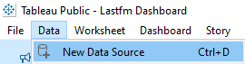
3. Select the *Microsoft Excel* option

    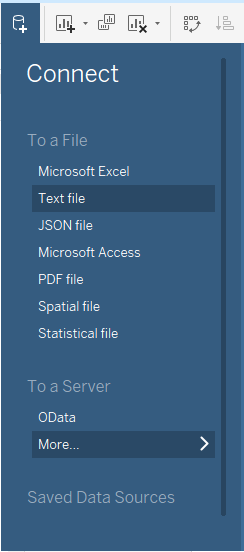

4. Select the `lastfm_extract_{username}.xlsx` file that you created with the script. That will take you to this page:

    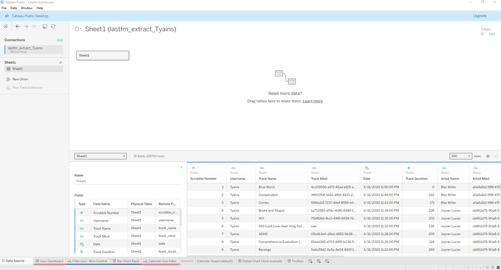

5. Download the [dates_2010_2030.xslx](extract_folder/dates_2010_2030.xlsx) Excel File. You'll need it to scaffold the data with dates from days you have no listening history.
6. Click on 'Add' in Connections > Microsoft Excel > dates_2010_2030.xlsx

    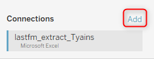

7. Double Click "Sheet 1" (or Right-Click & press *Open...*), then click on *dates_2010_2030* and drag the `Sheet1` underneath "Sheets" to the right:

    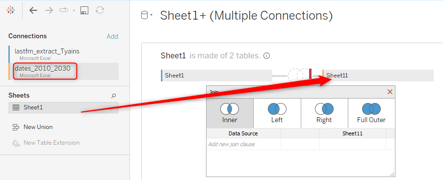

8. Select Full Outer Join as the Join. Then on the left join clause select the last option - *Create Join Calculation* and write    
    ```
    DATE([Date])
    ```
    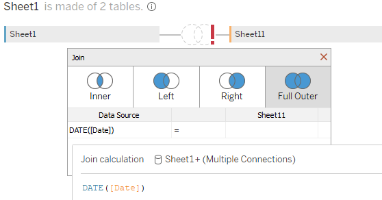

    Do the same for the Right join clause

    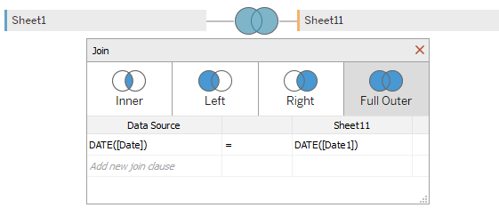

9. Click on the X on the right, below Filters.
    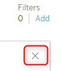

10. Add a new connection > Microsoft Excel > musicbrainz_artist_info.xlsx

    Then select musicbrainz_artist_info and drag Sheet1 to the right. After that select the "noodle" linking both rectangles and ensure their relationship is linked by *'Artist Mbid'*

    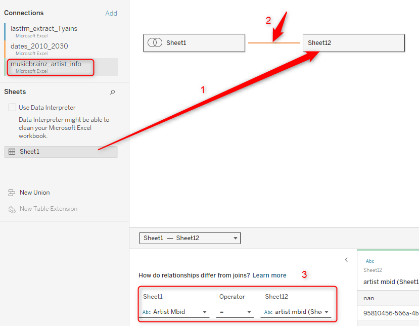

11. Add a 4th new connection > Microsoft Excel > user_{username}.xlsx

    Also add Sheet1 to the right and ensure the relationship is linked by *Username*

    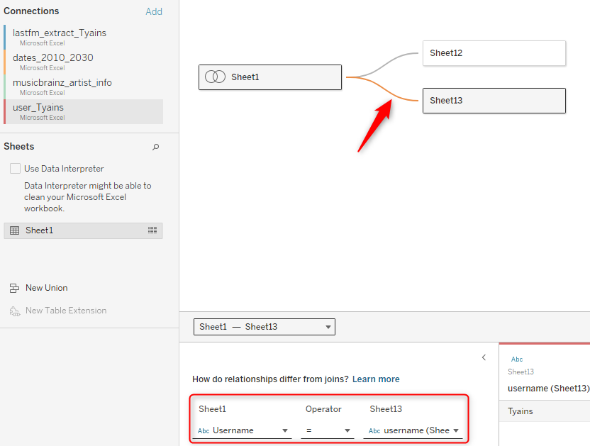

12. Open a new worksheet. Select Data > Replace Data Source. Then in *Current* select 'Lastfm Data' and for *Replacement* select the newly created data source and click OK

    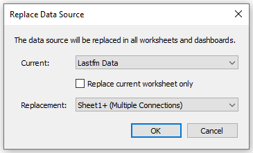

    You will receive a couple of error messages, but you can simply ignore them.

After that, you're good to go! Now the dashboard is all ready for you to hopefully get some interesting insights out of your listening history!

Unfortunately the replacement of the data source makes so that some default features such as coloring and sorting are lost, but feel free to redo them with your own taste, or contact me with any questions!

If you intend to refresh the data in the future, that's easier and quicker!
Simply rerun the script, which will bring the missing scrobbles. After that, go into your dashboard, right click your data source, followed by *Refresh*.